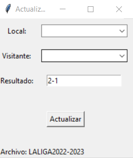
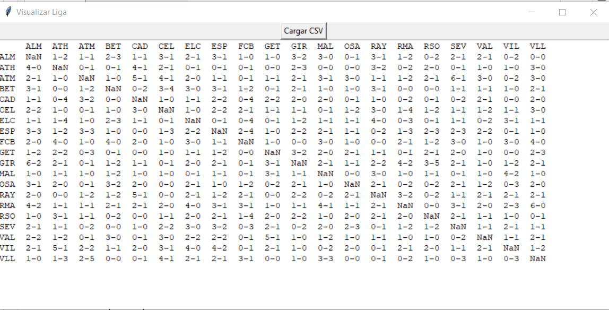
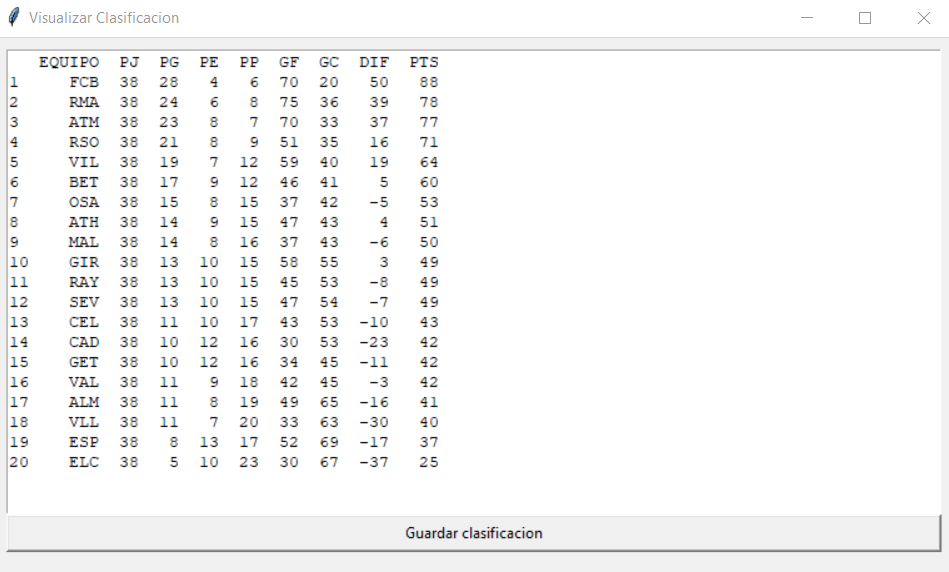
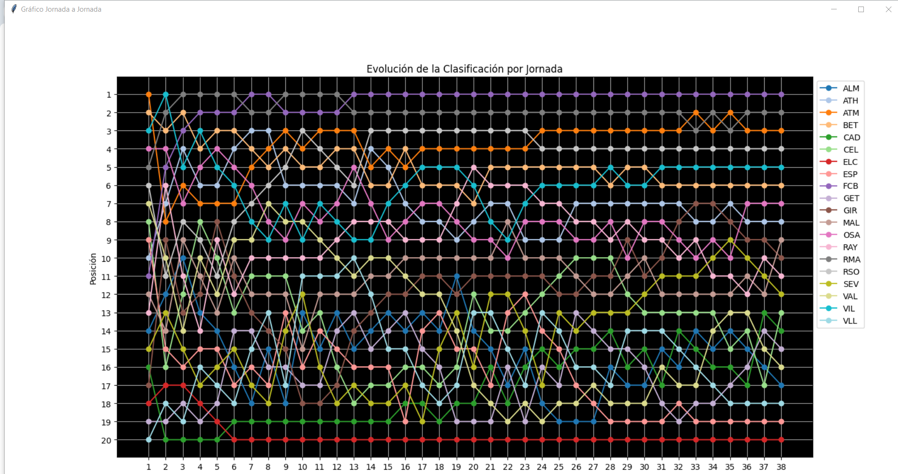

# ResultadosApp

This code is designed to track the seasons of LaLiga. It is developed using Pandas, Matplotlib, and Tkinter.

## Code Structure

### **Class App**:
  - This is the main screen when you open the program. It contains 5 different buttons to interact with.

### **Class CrearLiga**:
  - In this screen, you need to input the teams following this rule: they must be separated by commas. 

    Afterward, you must specify the name of the file created. When you click the submit button, two different CSV files will be created. One will be an N x N team scoresheet, to save all the results between teams. The other file will be used to track the different league positions of each team by game-weeks. 

    It's not necessary to name the file with the .csv extension; it will be named like that automatically. The second file will have the same name plus "clasificacion.csv".

### **Class ActualizarResultados**:
   - When opening this screen, you will find three placeholders to input your text. The first one will indicate the home team, the second one the visiting team, and the third one will indicate the score. **Important**: the score must follow the next format: X-Y, including the dash symbol.

     When you click the update button, the scoresheet CSV will update itself, filling in the cell that corresponds to the match between the two teams.

     

### **Class VisualizarLigas**:
   - This screen has a button that will allow you to choose the document you want to see. It must be the scoresheet document, the one that does not end with "clasificacion". This screen will show you the scoresheet document.
      

### **Class VisualizarClasificacion**:
   - After selecting that button, you will have to choose the document you want to see. It must be the one that does not end with "clasificacion". Afterward, the league table will be calculated by iterating over the scoresheet document. Then it will be sorted by the **points** of the teams and the tie-breaking criteria of the competition. Once you want to save the positions of the teams in every match week, you will have to press the button "Guardar clasificacion". That will update the file ending with "clasificacion", to view it later.

     As this classification is calculated on-the-fly, iterating over the results, the more results we have, the longer it will take, potentially reaching around 2 seconds. This is an improvement to be implemented in future updates.

     

### **Class VisualizarClasificacionGrafico**:
   - After selecting that button, you will have to choose the document you want to see. It must be the one that ends with "clasificacion". This class is designed to view the evolution of the standings throughout the season in a point graph. You will see a point graph made with Matplotlib, containing the standings, the game weeks, and the teams detailed in the legend.

     

### Upcoming Enhancements

In our forthcoming updates, we are committed to enhancing the efficiency and user experience of our league table calculation system. This initiative is driven by our dedication to addressing the current challenges with processing speed. Key improvements include:

1. **Optimization of League Table Calculations**: We are exploring advanced algorithms and data handling techniques to significantly speed up the computation of league standings. This enhancement aims to provide a more seamless and responsive user experience.

2. **Single-File Selection Mechanism**: To streamline the user interaction, we are implementing a feature that will require file selection only once during the session. This modification is designed to reduce redundant actions and increase user efficiency.

3. **Enhancement of League Standings Archiving**: Building upon our existing feature that allows the graphical representation of league standings, we are transitioning from a manual, button-activated process to a fully automated system. This upgrade will automatically archive league standings into a dedicated file after each update, seamlessly integrating this process into the user workflow. The result is a more efficient and user-friendly experience, providing continuous access to a visual evolution of the league standings throughout the season, without the need for manual intervention.

4. **Detailed Game Week Analysis**: A new feature will enable users to examine each game week individually, providing insights into the specific results and their impact on the overall league standings. This granular view will cater to users seeking in-depth analysis of the league progression.

These updates underscore our commitment to delivering a robust and user-friendly experience, ensuring our platform remains at the forefront of league management solutions.
